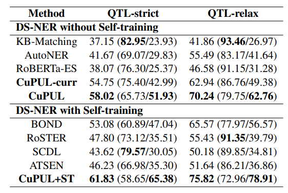

# CuPUL for Historical NER
Fork of [liyp0095/CuPUL](https://github.com/liyp0095/CuPUL) with added datasets. Work in progress.

## Historical NER Instructions

### Datasets preparation
- `source scripts/prepare_hdsner.sh`
  - clones the datasets submodule
  - creates the datasets conda environment
  - downloads and pre-processes the datasets, with sequence length 64

### Environment setup
This is the setup of the model environment, which differs from the one in the submodule. \
`conda env create -n CuPUL -f environment.yml` \
`conda activate CuPUL`

### Format data and run model
`bash scripts/run_hdsner.sh supervised` # supervised setting \
`bash scripts/run_hdsner.sh distant` # distantly-supervised setting \
Results will be in data-hdsner-(supervised|distant)-DATASET. \
**NOTE**: this will overwrite previous results.

### Evaluate results
- `source scripts/eval_hdsner.sh`
  - activate the datasets environment
  - evaluates results, writing to `data/hdsner_report_(valid|test)_(ct|st).json`
    - ct: curriculum training - st: self-training
    - it contains both supervised and distant results, if previously run, in the same file

# Forked Readme

## Re-Examine Distantly Supervised NER: A New Benchmark and a Simple Approach

This paper delves into Named Entity Recognition (NER) under the framework of Distant Supervision (DS-NER), where the main challenge lies in the compromised quality of labels due to inherent errors such as false positives, false negatives, and positive type errors. We critically assess the efficacy of current DS-NER methodologies using a real-world benchmark dataset named QTL, revealing that their performance often does not meet expectations. To tackle the prevalent issue of label noise, we introduce a simple yet effective approach, Curriculum-based Positive-Unlabeled Learning CuPUL, which strategically starts on "easy" and cleaner samples during the training process to enhance model resilience to noisy samples. Our empirical results highlight the capability of CuPUL to significantly reduce the impact of noisy labels and outperform existing methods.

### Performance of DS-NER Methods on QTL 
F1 Score (Precision/Recall) (in %). The best results are in **bold**, second
best results are in <ins>underline</ins>.



### Environment

Python 3.7.6, pytorch 1.12

### How to run

For example, on CoNLL2003

```python
python train.py --do_train --do_eval --dataset_name CoNLL2003_KB \
        --train_epochs 2 --train_lr 2e-5 --drop_other 0.5  \
        --curriculum_train_sub_epochs 1 --curriculum_train_lr 5e-5  \ 
        --curriculum_train_epochs 5  \ 
        --self_train_epochs 5 --self_train_lr 5e-7 --m 50  --max_seq_length 150 
```

on QTL dataset,


```python
python train.py --do_train --do_eval --dataset_name QTL \ 
        --loss_type MAE --m 20     \
        --train_epochs 1 --train_lr 5e-7 --drop_other 0.5  \
        --curriculum_train_sub_epochs 1 --curriculum_train_lr 2e-7  \ 
        --curriculum_train_epochs 5 --self_train_lr 5e-7 --self_train_epochs 5  \
        --max_seq_length 300
```

Parameters are tuned from validation set, and all hyper-parameters show in Appendix D, Table 5. 

Predict on QTL. It will load model in ../data/{args.dataset_name}/output and predict ../data/{args.dataset_name}/test.txt.

```python
python predict.py --dataset_name QTL \ 
        --loss_type MAE --m 20     \
        --train_epochs 1 --train_lr 5e-7 --drop_other 0.5  \
        --curriculum_train_sub_epochs 1 --curriculum_train_lr 2e-7  \ 
        --curriculum_train_epochs 5 --self_train_lr 5e-7 --self_train_epochs 5  \
        --max_seq_length 300
```

### Citation

```
@inproceedings{li-etal-2025-examine,
    title = "Re-Examine Distantly Supervised {NER}: A New Benchmark and a Simple Approach",
    author = "Li, Yuepei  and
      Zhou, Kang  and
      Qiao, Qiao  and
      Wang, Qing  and
      Li, Qi",
    editor = "Rambow, Owen  and
      Wanner, Leo  and
      Apidianaki, Marianna  and
      Al-Khalifa, Hend  and
      Eugenio, Barbara Di  and
      Schockaert, Steven",
    booktitle = "Proceedings of the 31st International Conference on Computational Linguistics",
    month = jan,
    year = "2025",
    address = "Abu Dhabi, UAE",
    publisher = "Association for Computational Linguistics",
    url = "https://aclanthology.org/2025.coling-main.727/",
    pages = "10940--10959",
    abstract = ""
}
```